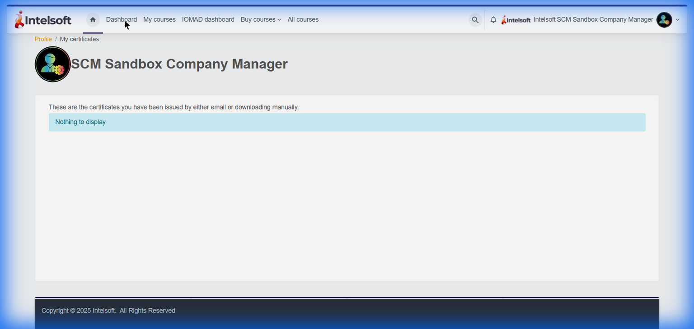
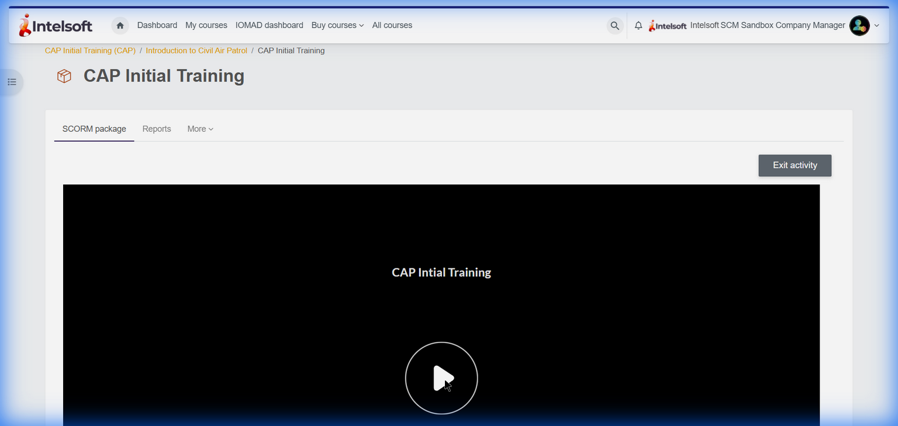
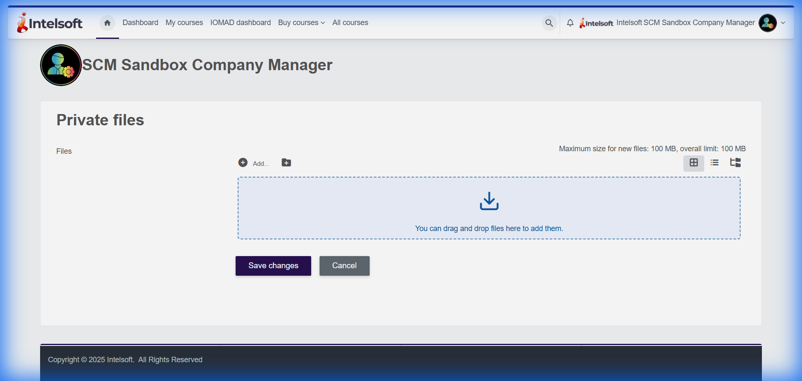
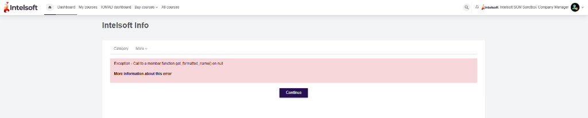
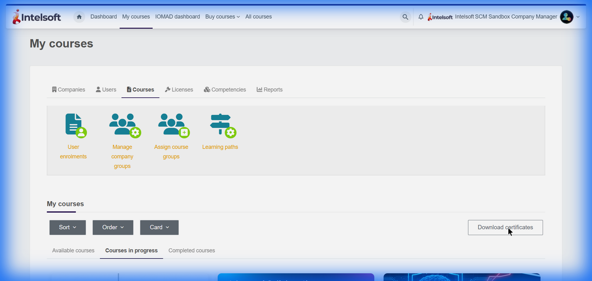
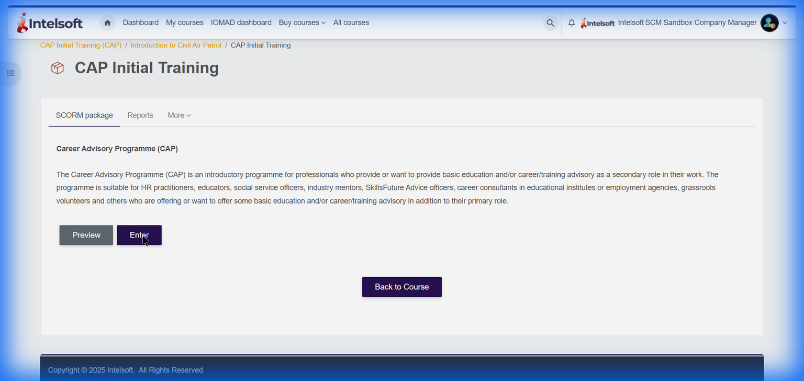

# Intelsoft LMS Testing - Issue Report

**Test Date:** January 22, 2026  
**Tested URL:** https://intelsoft.info/my/  
**Tester:** Automated Testing Session

---

## Executive Summary

During comprehensive testing of the Intelsoft LMS platform, **7 significant issues** were identified that impact user experience, course accessibility, and platform functionality.

---

## Issue #1: Certificates Display - "Nothing to Display" Error

| Field        | Details                            |
| ------------ | ---------------------------------- |
| **Severity** | Medium                             |
| **Location** | My Courses → Download Certificates |
| **Status**   | Open                               |

### Description

The "Download certificates" section displays "Nothing to display" message even when the user is enrolled in multiple courses (60 courses visible in the system).

### Expected Result

- If courses are completed: Certificates should be available for download
- If no courses completed: A clear message like "No certificates earned yet - complete a course to earn certificates"

### Actual Result

Shows "Nothing to display" with no additional context or guidance for the user.

### Screenshot



---

## Issue #2: SCORM Content Loading with Play Button

| Field        | Details                              |
| ------------ | ------------------------------------ |
| **Severity** | High                                 |
| **Location** | CAP Initial Training → SCORM Package |
| **Status**   | Open                                 |

### Description

When accessing SCORM training content, the course displays a persistent loading state with a play button overlay, indicating content may not be loading properly.

### Expected Result

SCORM content should load automatically and begin playing without requiring additional user interaction, or clearly indicate loading progress.

### Actual Result

Content appears stuck with a play button overlay on a dark background, potentially indicating media loading issues.

### Screenshot



---

## Issue #3: SCORM Media Blocking (Content Security Policy)

| Field        | Details                 |
| ------------ | ----------------------- |
| **Severity** | High                    |
| **Location** | SCORM Training Packages |
| **Status**   | Open                    |

### Description

Browser console logs reveal that audio/video files embedded in SCORM packages using base64 encoding are being blocked by the Content Security Policy (CSP).

### Error Message

```
Loading media from 'data:audio/mp3;base64,...' violates the following
Content Security Policy directive: "media-src 'self' blob: https://intelsoft.info"
```

### Expected Result

All media content within SCORM packages should play without CSP restrictions.

### Actual Result

Audio and video content fails to play due to CSP blocking base64-encoded media sources.

### Recommended Fix

Update the Content Security Policy to allow `data:` sources for media:

```
media-src 'self' blob: data: https://intelsoft.info
```

---

## Issue #4: Font Decoding Errors

| Field        | Details   |
| ------------ | --------- |
| **Severity** | Low       |
| **Location** | Site-wide |
| **Status**   | Open      |

### Description

Multiple console errors indicate that custom fonts are failing to decode properly.

### Error Messages

```
Failed to decode downloaded font: https://intelsoft.info/theme/font.php/.../OpenSans-Bold.ttf
Failed to decode downloaded font: https://intelsoft.info/theme/font.php/.../OpenSans-Regular.ttf
```

### Expected Result

Fonts should load and render correctly throughout the platform.

### Actual Result

Font files fail to decode, potentially causing inconsistent typography or fallback to system fonts.

---

## Issue #5: Private Files Section - Loading State

| Field        | Details                   |
| ------------ | ------------------------- |
| **Severity** | Low                       |
| **Location** | User Menu → Private Files |
| **Status**   | Needs Verification        |

### Description

The Private Files section file manager may experience delayed loading states.

### Screenshot



---

## Issue #6: Placeholder Text on Manager Dashboard Banner

| Field         | Details                    |
| ------------- | -------------------------- |
| **Severity**  | Medium                     |
| **Location**  | Manager Dashboard → Banner |
| **User Role** | Manager                    |
| **Status**    | Open                       |

### Description

While reviewing the Manager dashboard, placeholder text "Lorem ipsum dolor sit amet…" is displayed in the banner section. This appears to be dummy content and is not meaningful for end users.

### Expected Result

Meaningful and relevant content (such as welcome message, announcements, or platform information) should be displayed instead of placeholder text.

### Actual Result

The banner displays Lorem ipsum placeholder text: "Lorem ipsum dolor sit amet, consectetur adipiscing elit, sed diam nonumy eirmod tempor invidunt ut labore et dolore magna aliquyam erat, sed diam voluptua."

### Screenshot


---

## Issue #7: Course Search System Error

| Field         | Details                            |
| ------------- | ---------------------------------- |
| **Severity**  | Critical                           |
| **Location**  | Manager → Courses → Search courses |
| **User Role** | Manager                            |
| **Status**    | Open                               |

### Description

While testing the Search courses feature in the Manager account, the system fails to return results when a valid course name is searched. Instead, it redirects to an error page and displays a system exception message, exposing a backend error to the user.

### Expected Result

The system should display matching course results or a user-friendly message if no courses are found (e.g., "No courses found matching your search").

### Actual Result

The system displays an error message:

```
Exception – Call to a member function get_formatted_name() on null
```

No search results are shown, and the backend exception is exposed to the user.

### Screenshots

**Search Page (before error):**


**Error Page:**


---

## Additional Observations

### Course Management Interface

The My Courses interface displays with proper functionality. User management, course groups, and learning paths are accessible.



### Course Content Page

CAP Initial Training course content page shows proper structure with SCORM package, Reports, and More tabs.



---

## Testing Session Recording

A complete video recording of the testing session is available:


---

## Summary Table

| Issue # | Description                       | Severity | Impact                      |
| ------- | --------------------------------- | -------- | --------------------------- |
| 1       | Certificates "Nothing to Display" | Medium   | User confusion              |
| 2       | SCORM Content Loading State       | High     | Training access blocked     |
| 3       | CSP Blocking Media                | High     | Audio/Video fails           |
| 4       | Font Decoding Errors              | Low      | Visual inconsistency        |
| 5       | Private Files Loading             | Low      | File management delay       |
| 6       | Lorem Ipsum Placeholder Text      | Medium   | Unprofessional appearance   |
| 7       | Course Search System Error        | Critical | Search functionality broken |

---

## Recommendations

1. **Critical Priority:** Fix Course Search functionality (Issue #7) - backend null reference error
2. **Immediate Priority:** Fix CSP policy to allow SCORM media content
3. **High Priority:** Investigate SCORM content loading issues
4. **Medium Priority:** Replace placeholder Lorem Ipsum text with meaningful content
5. **Medium Priority:** Add clearer messaging for empty certificate states
6. **Low Priority:** Fix font file serving configuration
