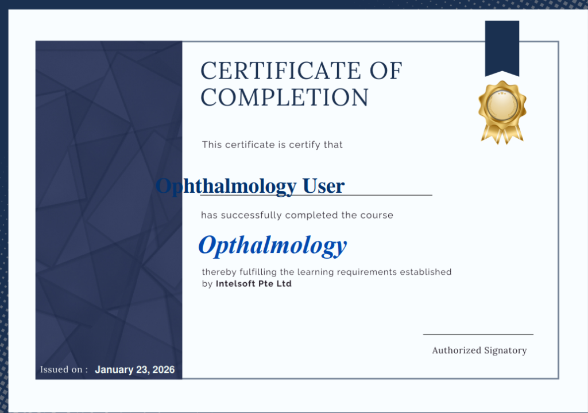

# Intelsoft LMS Testing - Issue Report

## Issue #1: SCORM Content Loading with Play Button

| Field        | Details                              |
| ------------ | ------------------------------------ |
| **Severity** | High                                 |
| **Location** | CAP Initial Training → SCORM Package |
| **Status**   | Open                                 |

### Description

When accessing SCORM training content, the course displays a persistent loading state with a play button overlay, indicating content may not be loading properly.

### Expected Result

SCORM content should load automatically and begin playing without requiring additional user interaction, or clearly indicate loading progress.

### Actual Result

Content appears stuck with a play button overlay on a dark background, potentially indicating media loading issues.

### Screenshot


---

## Issue #2: SCORM Media Blocking (Content Security Policy)

| Field        | Details                 |
| ------------ | ----------------------- |
| **Severity** | High                    |
| **Location** | SCORM Training Packages |
| **Status**   | Open                    |

### Description

Browser console logs reveal that audio/video files embedded in SCORM packages using base64 encoding are being blocked by the Content Security Policy (CSP).

### Error Message

```
Loading media from 'data:audio/mp3;base64,...' violates the following
Content Security Policy directive: "media-src 'self' blob: https://intelsoft.info"
```

### Expected Result

All media content within SCORM packages should play without CSP restrictions.

### Actual Result

Audio and video content fails to play due to CSP blocking base64-encoded media sources.

### Recommended Fix

Update the Content Security Policy to allow `data:` sources for media:

```
media-src 'self' blob: data: https://intelsoft.info
```

---

## Issue #3: Font Decoding Errors

| Field        | Details   |
| ------------ | --------- |
| **Severity** | Low       |
| **Location** | Site-wide |
| **Status**   | Open      |

### Description

Multiple console errors indicate that custom fonts are failing to decode properly.

### Error Messages

```
Failed to decode downloaded font: https://intelsoft.info/theme/font.php/.../OpenSans-Bold.ttf
Failed to decode downloaded font: https://intelsoft.info/theme/font.php/.../OpenSans-Regular.ttf
```

### Expected Result

Fonts should load and render correctly throughout the platform.

### Actual Result

Font files fail to decode, potentially causing inconsistent typography or fallback to system fonts.

---

## Issue #4: Private Files Section - Loading State

| Field        | Details                    |
| ------------ | -------------------------- |
| **Severity** | Low                        |
| **Location** | User Menu → Private Files  |
| **Status**   | Open (Verified 4-5s delay) |

### Description

The Private Files section file manager consistently displays a "Loading..." spinner for approximately 4-5 seconds before becoming interactive, creating a sluggish user experience.

### Screenshot


---

## Issue #5: Placeholder Text on Manager Dashboard Banner

| Field         | Details                    |
| ------------- | -------------------------- |
| **Severity**  | Medium                     |
| **Location**  | Manager Dashboard → Banner |
| **User Role** | Manager                    |
| **Status**    | Open                       |

### Description

While reviewing the Manager dashboard, placeholder text "Lorem ipsum dolor sit amet…" is displayed in the banner section. This appears to be dummy content and is not meaningful for end users.

### Expected Result

Meaningful and relevant content (such as welcome message, announcements, or platform information) should be displayed instead of placeholder text.

### Actual Result

The banner displays Lorem ipsum placeholder text: "Lorem ipsum dolor sit amet, consectetur adipiscing elit, sed diam nonumy eirmod tempor invidunt ut labore et dolore magna aliquyam erat, sed diam voluptua."

### Screenshot


---

## Issue #6: Course Search System Error

| Field         | Details                            |
| ------------- | ---------------------------------- |
| **Severity**  | Critical                           |
| **Location**  | Manager → Courses → Search courses |
| **User Role** | Manager                            |
| **Status**    | Open                               |

### Description

While testing the Search courses feature in the Manager account, the system fails to return results when a valid course name is searched. Instead, it redirects to an error page and displays a system exception message, exposing a backend error to the user.

### Expected Result

The system should display matching course results or a user-friendly message if no courses are found (e.g., "No courses found matching your search").

### Actual Result

The system displays an error message:

```
Exception – Call to a member function get_formatted_name() on null
```

No search results are shown, and the backend exception is exposed to the user.

### Screenshots

**Search Page (before error):**


**Error Page:**


---

## Additional Observations

### Course Management Interface

The My Courses interface displays with proper functionality. User management, course groups, and learning paths are accessible.


### Course Content Page

CAP Initial Training course content page shows proper structure with SCORM package, Reports, and More tabs.


---

## Testing Session Recording

A complete video recording of the testing session is available:


---

## Issue #7: Public Homepage Placeholder Content (NEW - Public Access)

| Field        | Details                                  |
| ------------ | ---------------------------------------- |
| **Severity** | High                                     |
| **Location** | Public Homepage (https://intelsoft.info) |
| **Status**   | Open                                     |

### Description

The public homepage displays Lorem ipsum placeholder text in the slideshow banners, which is unprofessional and indicates incomplete content setup.

### Homepage Content Analysis

**Slideshow Banners (All 3 banners show identical placeholder text):**

```
Lorem ipsum dolor sit amet, consetetur sadipscing elitr, sed diam nonumy eirmod tempor invidunt ut labore et dolore magna aliquyam erat, sed diam voluptua.
```

### Expected Result

- Professional, relevant content about the LMS platform
- Information about courses, features, or company services
- No placeholder text visible to the public

### Actual Result

- - Lorem ipsum placeholder text prominently displayed
- Unprofessional appearance for public visitors
- Content appears incomplete or under development

### Public Access Concern

The homepage is accessible without login, meaning any internet user can see this placeholder content.

### Screenshot


---

## Issue #8: Missing Course Progress Indicators

| Field        | Details                |
| ------------ | ---------------------- |
| **Severity** | Medium                 |
| **Location** | Dashboard & My Courses |
| **Status**   | Open                   |

### Description

Course cards on the Dashboard and "My Courses" page fail to display any visual progress indicators (e.g., progress bars or "X% complete" text), even for active courses. The dashboard summary explicitly states "0 Courses completed" and "0 Activities completed" despite ongoing activity.

### Expected Result

Active courses should display a progress bar or percentage to indicate the user's advancement through the material.

### Actual Result

No progress information is visible on course cards, leaving users unaware of their standing.

### Screenshot


---

## Issue #9: Unclear Activity Completion Tracking

| Field        | Details              |
| ------------ | -------------------- |
| **Severity** | Medium               |
| **Location** | Course Content Pages |
| **Status**   | Open                 |

### Description

Inside courses (e.g., "Fundamentals of Python Programming"), there are no manual "Mark as done" buttons or clear visual confirmations when an activity is completed.

### Expected Result

Users should have clear feedback (checkboxes, "Done" labels, or manual toggle buttons) to track which activities they have completed.

### Actual Result

Activity completion status is invisible or missing, making self-pacing difficult.

### Screenshot


---

## Issue #10: Grade Report System Warning

| Field        | Details            |
| ------------ | ------------------ |
| **Severity** | High               |
| **Location** | User Menu → Grades |
| **Status**   | Open               |

### Description

When accessing the Grade Report for a specific course, a critical system warning is displayed: "Warning: Activity deletion in progress! Some grades are about to be removed."

### Expected Result

Grade reports should display student grades cleanly without exposing backend maintenance warnings to end users.

### Actual Result

Users are presented with an alarming warning message suggesting data loss or system instability.

### Screenshot


---

## Issue #11: Manager Role Permissions Missing (Add Course / Site Admin)

| Field        | Details                         |
| ------------ | ------------------------------- |
| **Severity** | Critical                        |
| **Location** | Dashboard / Site Administration |
| **Status**   | Open                            |

### Description

The user logged in as "Manager" (`sandboxcm`) lacks critical permissions expected for this role.

1.  **Missing "Add Course" functionality**: There is no button to create new courses.
2.  **Missing "Site Administration"**: The administration block is completely absent.

### Expected Result

A Manager should be able to create new courses and access relevant Site Administration settings for course/user management.

### Actual Result

The user is restricted to viewing existing courses without creation capabilities, rendering the "Manager" role ineffective.

### Screenshot


---

## Issue #12: Missing Edit Mode & Enrollment Controls

| Field        | Details                    |
| ------------ | -------------------------- |
| **Severity** | High                       |
| **Location** | Course Page / Participants |
| **Status**   | Open                       |

### Description

Within a specific course (e.g., "CAP Initial Training"), the Manager is unable to perform basic management tasks:

1.  **Edit Mode Missing**: The "Edit mode" toggle (usually top right) is not available inside the course, preventing any content changes.
2.  **Enrol Users Missing**: The "Participant" tab lacks the standard "Enroll users" button.

### Expected Result

Managers must be able to:

- Toggle "Edit mode" to add/remove activities and resources.
- Manually enroll users into the course via the Participants tab.

### Actual Result

The interface is locked in "View only" mode for the Manager, similar to a Student view.

### Screenshots

**Missing Edit Mode:**


**Missing Enroll Button:**


---

## Issue #13: Public Site Issues (Guest View)

| Field        | Details                        |
| ------------ | ------------------------------ |
| **Severity** | High                           |
| **Location** | Homepage, Course Pages, Footer |
| **Status**   | Open                           |

### Description

A public audit of `lms-demo.intelsoft.sg` revealed significant incomplete content visible to unauthenticated guests.

1.  **Homepage Placeholders:** "Lorem ipsum" text is prominently displayed in the main sliders.
2.  **Broken Technical Tags:** The Course Enrolment page displays raw code tags `[[nocourseduration]]` instead of the course duration.
3.  **Empty Footer:** The footer lacks standard links (Privacy Policy, Contact, Terms), showing a bare layout.

### Expected Result

- Homepage should contain real marketing copy.
- Technical tags should render actual values or be hidden.
- Footer should contain legal and contact links.

### Actual Result

- "Lorem ipsum" visible to public.
- `[[nocourseduration]]` visible to public.
- Footer is empty.

### Recommended Fix

1.  **Content**: Provide and upload final text for homepage banners.
2.  **Development**: Debug the `[[nocourseduration]]` shortcode in the course page template.
3.  **Layout**: Add "Contact Us" and "Privacy Policy" pages and link them in the footer.

### Screenshots

**Guest Homepage (Lorem Ipsum):**


**Broken Duration Tag:**


---

## Issue #14: Empty Course Category Listings

| Field        | Details                                    |
| ------------ | ------------------------------------------ |
| **Severity** | High                                       |
| **Location** | Courses → Category View (e.g. Pulmonology) |
| **Status**   | Open                                       |

### Description

When navigating to a specific course category (e.g., "Pulmonology") or searching for courses, the content area displays as completely empty. The category title is visible, but no courses are listed, even though the side menu structure suggests categories exist.

### Actual Result

- **Content Area:** Completely blank white space under the category dropdown.
- **Sidebar:** Categories are listed, but selecting one shows no content.

### Expected Result

- The page should display a grid or list of courses available within the selected category.
- If no courses exist, a clear "No courses available in this category" message should be displayed.

### Screenshot

**Empty Category View:**


---

## Issue #15: Certificate Text Errors (Typos & Grammar)

| Field        | Details                                   |
| ------------ | ----------------------------------------- |
| **Severity** | High (Reputation Risk)                    |
| **Location** | Certificate of Completion (Ophthalmology) |
| **Status**   | Open                                      |

### Description

The generated Certificate of Completion contains significant spelling and grammatical errors that impact professional credibility.

### Identified Errors

1.  **Grammar**: "This certificate is **certify** that" (Incorrect). Should be "This certificate **certifies** that" or "This is to certify that".
2.  **Spelling**: Course name "Ophthalmology" is misspelled as "**Opthalmology**" (Missing 'h').
3.  **Layout**: The User Name ("Ophthalmology User") overlaps with the introductory text line.

### Expected Result

- Text should read: "This is to certify that" OR "This certificate certifies that".
- Course name should be spelled correctly: "**Ophthalmology**".
- Layout should explicitly separate the prompt text from the user's name.

### Evidence



---

## Issue #16: Admin Footer Verification Failure

| Field        | Details                |
| ------------ | ---------------------- |
| **Severity** | Low                    |
| **Location** | Admin Dashboard Footer |
| **Status**   | Open                   |

### Description

The verification of the footer content failed. The expected text "Powered by Moodle" is missing from the footer. "Lorem Ipsum" placeholder text is NOT present (PASS), but the branding attribution is missing.

### Expected Result

Footer should likely contain "Powered by Moodle" (unless white-labeled) and valid copyright info.

### Actual Result

"Powered by Moodle" string is missing from the footer.

---

## Issue #17: Admin Course Search Failure

| Field        | Details                       |
| ------------ | ----------------------------- |
| **Severity** | Medium                        |
| **Location** | Global Search / Course Search |
| **Status**   | Open                          |

### Description

Searching for the known course term "Ophthalmology" returned no results in the Admin view.

### Expected Result

The search should return the relevant "Ophthalmology" courses if they exist in the system (previously verified in User tests).

### Actual Result

### Actual Result

No courses found when searching for "Ophthalmology".

### Root Cause Discovery

The course exists in the system but is misspelled as "**Opthalmology**" (missing the first 'h'). Searching for this incorrect spelling returns the course.

### Recommended Fix

Rename the course to "Ophthalmology" so users can find it with the correct spelling.

---

## Issue #18: Student Course Access Failure (Critical)

| Field        | Details                         |
| ------------ | ------------------------------- |
| **Severity** | **Critical**                    |
| **Location** | Student Dashboard / Course Page |
| **Role**     | Student (Learner)               |
| **Status**   | Open                            |

### Description

After a Student is enrolled in a course (e.g., "AWS Check Course"), the course **does not appear** on their Dashboard. Attempting to access the course directly by URL redirects or shows an "Enrol me" page, indicating the system does not recognize the enrollment.

### Steps to Reproduce

1.  Log in as Admin.
2.  Enrol a user (e.g., `demolearner@moe.gov.sg`) into `AWS Check Course` as "Student".
3.  Log out and Log in as `demolearner@moe.gov.sg`.
4.  Check "My courses" on Dashboard.
5.  Attempt to access `/course/view.php?id=[ID]`.

### Expected Result

-   Course should appear on the Dashboard cards.
-   Direct link should open the Course Home Page.

### Actual Result

-   Dashboard shows "No courses found".
-   Direct link requests enrollment ("Enrol me") again.

### Evidence

-   **Verification Script Log**: `[X] No courses found on Dashboard.`
-   **Enrollment Confirmation**: Admin panel shows user is enrolled (Active).
