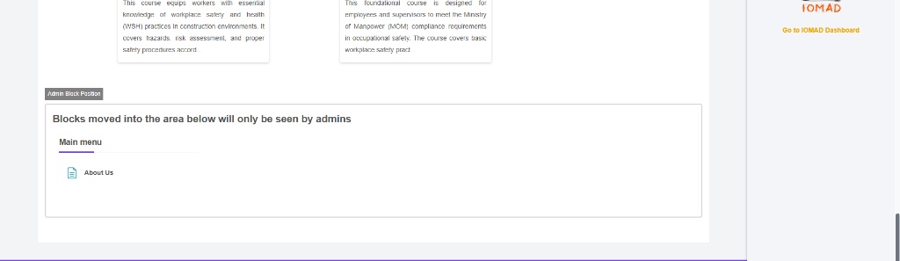
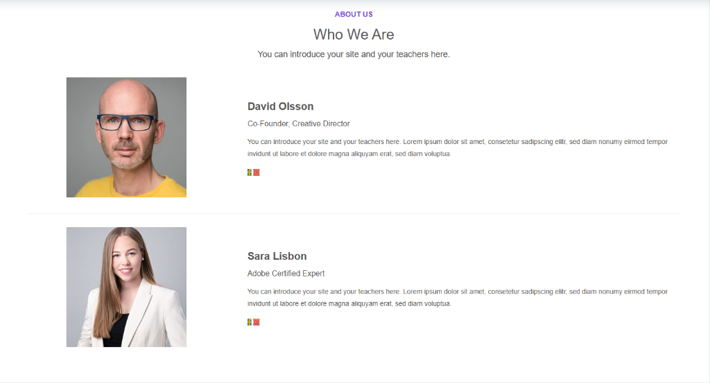
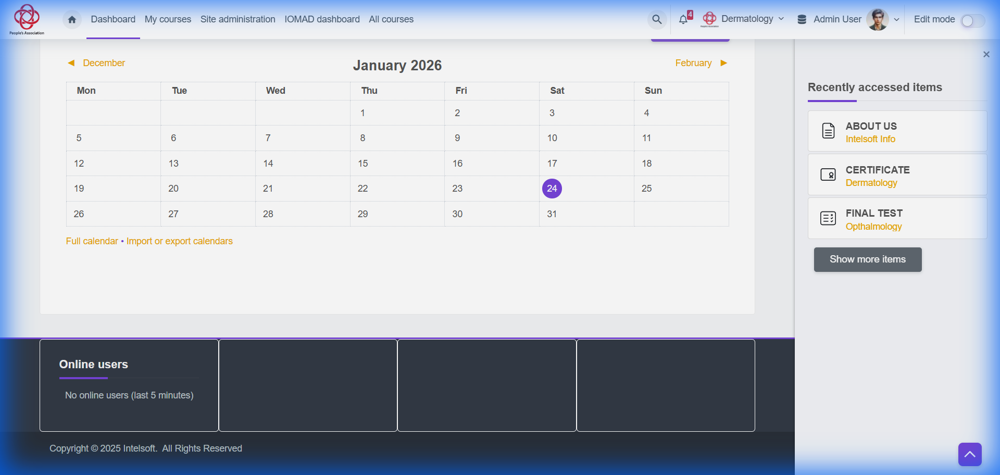
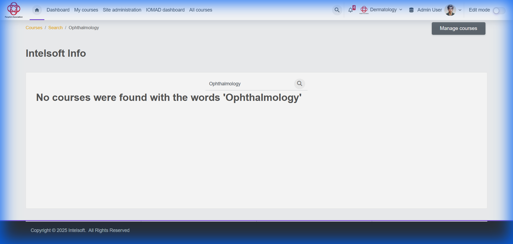

# Intelsoft LMS - Issues Report

## Testing Environment

- **Instance**: New AWS LMS Instance
- **URL**: `https://lms-demo.intelsoft.sg/login/index.php`

## Issue #1: Empty Course Category Listings

| Field        | Details                                    |
| ------------ | ------------------------------------------ |
| **Severity** | High                                       |
| **Location** | Courses → Category View (e.g. Pulmonology) |
| **Status**   | Open                                       |

### Description

When navigating to a specific course category (e.g., "Pulmonology") or searching for courses, the content area displays as completely empty. The category title is visible, but no courses are listed, even though the side menu structure suggests categories exist.

### Actual Result

- **Content Area:** Completely blank white space under the category dropdown.
- **Sidebar:** Categories are listed, but selecting one shows no content.

### Expected Result

- The page should display a grid or list of courses available within the selected category.
- If no courses exist, a clear "No courses available in this category" message should be displayed.

### Screenshot

**Empty Category View:**


---

## Issue #2: Certificate Text Errors (Typos & Grammar)

| Field        | Details                                   |
| ------------ | ----------------------------------------- |
| **Severity** | High (Reputation Risk)                    |
| **Location** | Certificate of Completion (Ophthalmology) |
| **Status**   | Open                                      |

### Description

The generated Certificate of Completion contains significant spelling and grammatical errors that impact professional credibility.

### Identified Errors

1.  **Grammar**: "This certificate is **certify** that" (Incorrect). Should be "This certificate **certifies** that" or "This is to certify that".
2.  **Spelling**: Course name "Ophthalmology" is misspelled as "**Opthalmology**" (Missing 'h').
3.  **Layout**: The User Name ("Ophthalmology User") overlaps with the introductory text line.

### Expected Result

- Text should read: "This is to certify that" OR "This certificate certifies that".
- Course name should be spelled correctly: "**Ophthalmology**".
- Layout should explicitly separate the prompt text from the user's name.

### Evidence


---

## Issue #3: Course Search System Exception Error

| Field        | Details                                |
| ------------ | -------------------------------------- |
| **Severity** | Critical                               |
| **Location** | Homepage → Course Search (Search icon) |
| **Status**   | Open (Verified on AWS Instance)        |

### Description

When clicking the **Search icon** in the course search area at the bottom of the homepage, the system throws a critical exception error instead of displaying search results or a search interface.

### Error Message

```
Exception - Call to a member function get_formatted_name() on null
```

### Actual Result

- Clicking the search icon triggers a fatal PHP exception.
- The system displays a red error banner with the exception message.
- The error suggests a null reference issue in the backend code.
- Users cannot access the course search functionality.

### Expected Result

- Clicking the search icon should open a search interface or display course search results.
- No system exceptions should be visible to end users.

### Evidence

**Search Interface (Before Click):**


**Exception Error (After Click):**


---

## Issue #4: About Us Page Placeholder Content

| Field        | Details              |
| ------------ | -------------------- |
| **Severity** | High (Public Facing) |
| **Location** | About Us Page        |
| **Account**  | Admin (Verified)     |
| **Status**   | Open                 |

### Description

The "About Us" page displays generic placeholder text ("Lorem ipsum dolor sit amet...") and stock imagery instead of actual company information. This page is publicly accessible and impacts the professional credibility of the platform.

### Actual Result

- **Text**: Displays Latin placeholder text in multiple sections ("What We Do", "We take learning to new heights").
- **Content**: Generic stock photos and "Moodle page resource" descriptions are visible.

### Expected Result

- The page should contain valid, finalized content describing Intelsoft's mission, team, and services.
- Placeholder text and stock descriptions should be removed.

### Evidence

**About Us Page (Lorem Ipsum):**


---

## Issue #5: Admin Block Layout Misalignment

| Field        | Details                              |
| ------------ | ------------------------------------ |
| **Severity** | Low (UI Fix)                         |
| **Location** | Global Layout / Admin Block Position |
| **Account**  | Admin                                |
| **Status**   | Open                                 |

### Description

The "Admin Block Position" container is visibly misaligned. The "Main Menu > About Us" block is floating in a large empty graphical container that does not span the full width correctly or center its content, leaving significant whitespace on the right side.

### Actual Result

- The Admin Block container appears disjointed from the main content layout.
- Excessive whitespace on the right side of the block.
- Visual inconsistency with the rest of the Moodle/IOMAD theme.

### Expected Result

- The Admin Block should be properly aligned (either full-width or sidebar) and integrated with the theme's grid system.

### Evidence

**Layout Misalignment:**


---

## Issue #6: Team Section Placeholders & Broken Social Links

| Field        | Details                              |
| ------------ | ------------------------------------ |
| **Severity** | High (Public Reliability)            |
| **Location** | About Us / Who We Are (Team Section) |
| **Account**  | Admin (Verified)                     |
| **Status**   | Open                                 |

### Description

The "Who We Are" team section contains placeholder profiles with stock photos and dummy names ("David Olsson", "Sara Lisbon").
Additionally, the social media icons on these profiles are functional but redirect to incorrect generic platforms (Pinterest/Facebook) where Intelsoft does not have an active presence.

### Actual Result

- **Content**: Dummy "Lorem ipsum" descriptions for team members.
- **Profiles**: Fake/Stock profiles ("David Olsson", "Sara Lisbon") are visible.
- **Links**: Social icons redirect to external sites (Pinterest/Facebook) unconnected to Intelsoft.

### Expected Result

- Team section should display real Intelsoft team members or be hidden until ready.
- Social media links should either point to official Intelsoft pages or be removed if unavailable.

### Evidence

**Team Placeholders & Social Icons:**


---

## Issue #7: Admin Footer Verification Failure

| Field        | Details                |
| ------------ | ---------------------- |
| **Severity** | Low                    |
| **Location** | Admin Dashboard Footer |
| **Status**   | Open                   |

### Description

The verification of the footer content failed. The expected text "Powered by Moodle" is missing from the footer, which relates to branding or white-labeling compliance.

### Expected Result

Footer should likely contain "Powered by Moodle" (unless white-labeled) and valid copyright info.

### Actual Result

"Powered by Moodle" string is missing from the footer.

### Evidence

**Footer (Missing Branding):**


---

## Issue #8: Admin Course Search Failure

| Field        | Details                       |
| ------------ | ----------------------------- |
| **Severity** | Medium                        |
| **Location** | Global Search / Course Search |
| **Status**   | Open                          |

### Description

Searching for the known course term "Ophthalmology" returned no results in the Admin view, creating a significant usability issue for course management.

### Expected Result

The search should return the relevant "Ophthalmology" courses if they exist in the system (previously verified in User tests).

### Actual Result

No courses found for "Ophthalmology".

### Root Cause Discovery

The course exists in the system but is misspelled as "**Opthalmology**" (missing the first 'h'). Searching for this incorrect spelling returns the course.

### Recommended Fix

Rename the course to "Ophthalmology" so users can find it with the correct spelling.

### Evidence

**Course Search Failure:**

